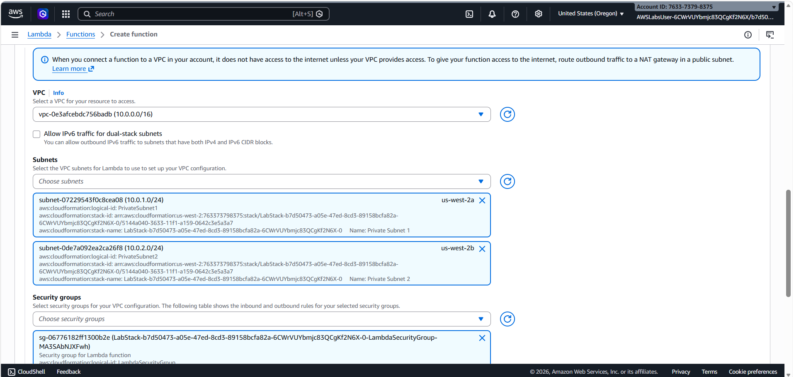
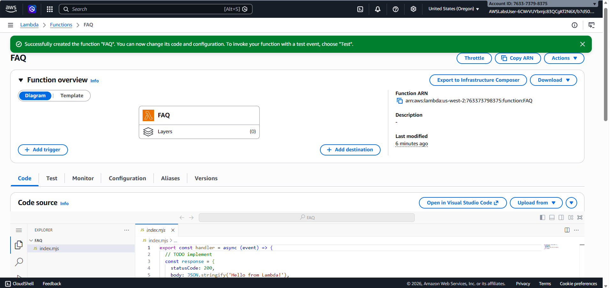
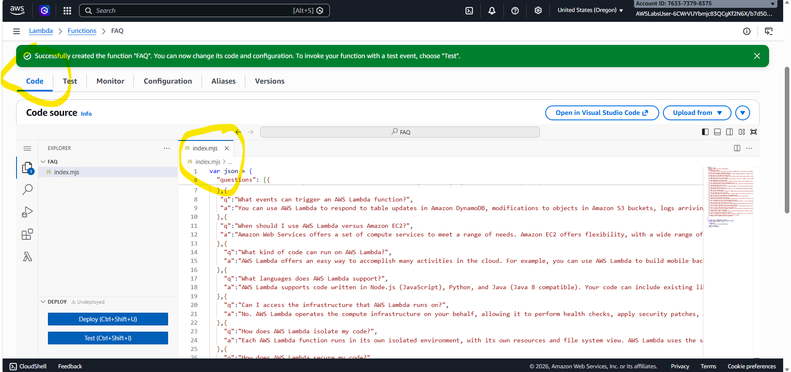
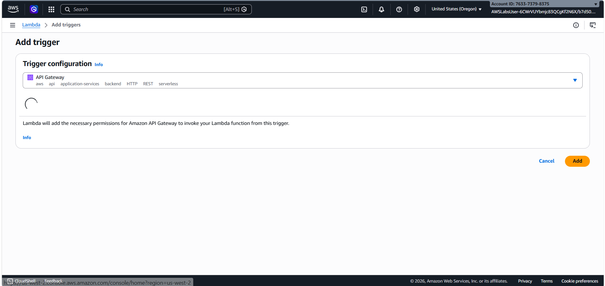
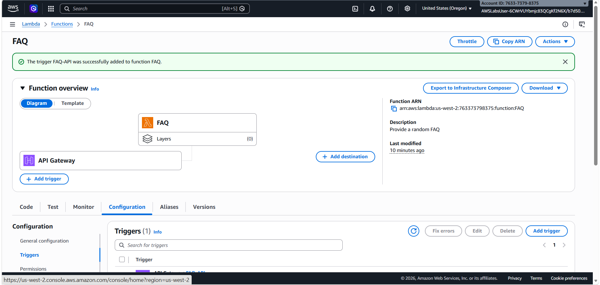
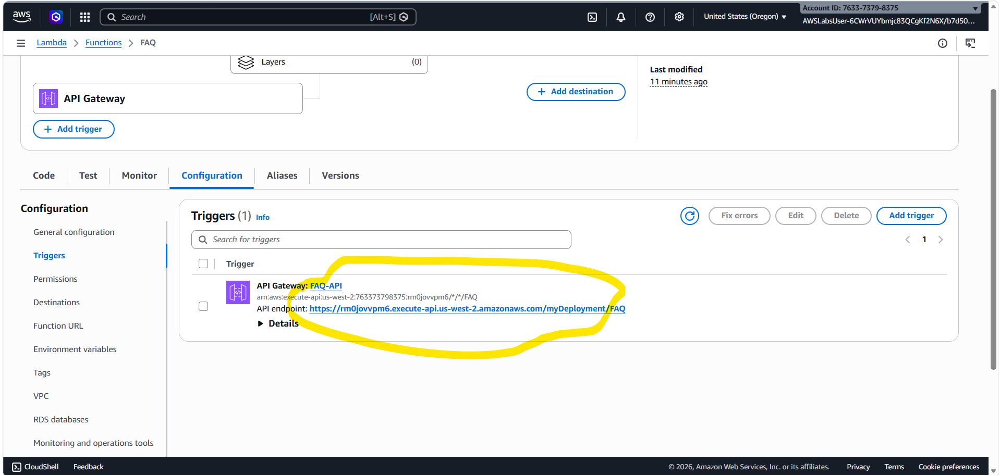

Mô hình hoạt động của Micro-service
Luồng đi của dữ liệu sẽ như sau:
Người dùng (Browser) → API Gateway (Nhận HTTP) → Lambda (Xử lý Logic & Random FAQ) → API Gateway (Phản hồi JSON) → Người dùng.

Task 1: Tạo hàm Lambda "FAQ"
Đây là nơi chứa code Node.js để xử lý việc chọn câu hỏi ngẫu nhiên.

Cấu hình quan trọng:

Runtime: Node.js 22.x.

Role: Chọn lambda-basic-execution (Đã được Lab cấp sẵn quyền ghi Log).

VPC (Bắt buộc): Lab này yêu cầu bảo mật cao, bạn phải chọn đúng VPC (10.0.0.0/16) và tích chọn cả 2 Subnets được yêu cầu.

Security Group: Chọn cái có tên LambdaSecurityGroup.
 

Lưu ý: Sau khi nhấn Create function, bạn phải đợi vài phút để AWS thiết lập card mạng (ENI) cho Lambda vào VPC. Đừng vội dán code ngay khi nó chưa báo "Successfully created".
 

Code Logic: Bạn sẽ dán đoạn code chứa danh sách câu hỏi FAQ. Hàm handler sẽ dùng Math.random() để bốc thăm một câu hỏi và trả về dưới dạng JSON string. Đừng quên nhấn Deploy sau khi dán code.
 

Task 2: Thiết lập API Gateway (Cửa ngõ)
lưu tí tạo trước Description
Bước này giúp biến hàm Lambda của bạn thành một địa chỉ Web (URL) có thể truy cập được.

Tại giao diện Lambda, nhấn Add trigger.

Chọn API Gateway làm nguồn.
 

Cấu hình API:

Intent: Create a new API.

API type: REST API.

Security: Open (Để bạn có thể test trực tiếp trên trình duyệt mà không cần mật khẩu).

API Name: FAQ-API.

Deployment stage: myDeployment.
 

Task 3: Kiểm tra và Giám sát
Test qua URL: Vào tab Configuration > Triggers, copy cái API endpoint. Dán nó vào trình duyệt, mỗi lần bạn nhấn F5 (Refresh), bạn sẽ thấy một câu hỏi/câu trả lời khác nhau hiện ra.
 

Test trong Console: Bạn có thể tạo Test Event với nội dung trống {} để kiểm tra xem Lambda có trả về đúng cấu trúc body hay không.

Debug: Nếu gặp lỗi, hãy vào tab Monitor > View CloudWatch logs. Các dòng console.log trong code sẽ hiện ra ở đây, giúp bạn biết câu hỏi nào vừa được chọn.