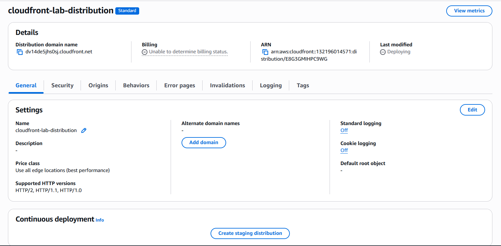
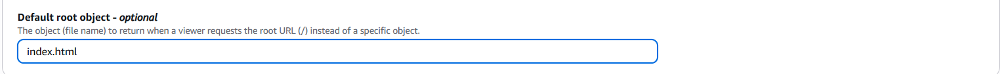
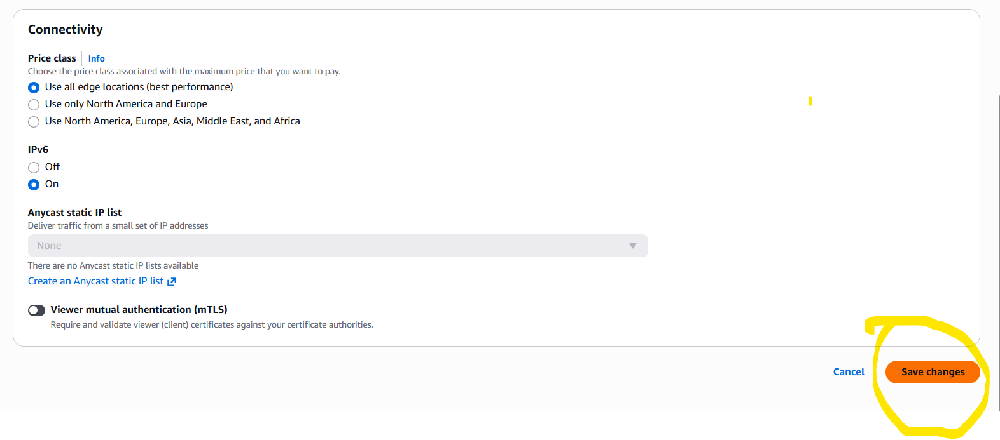
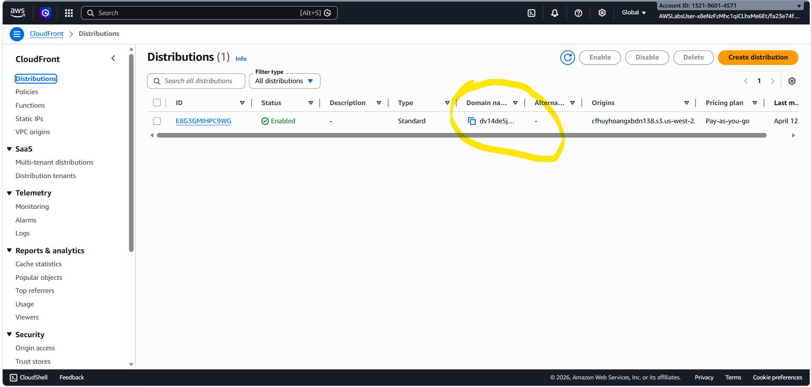
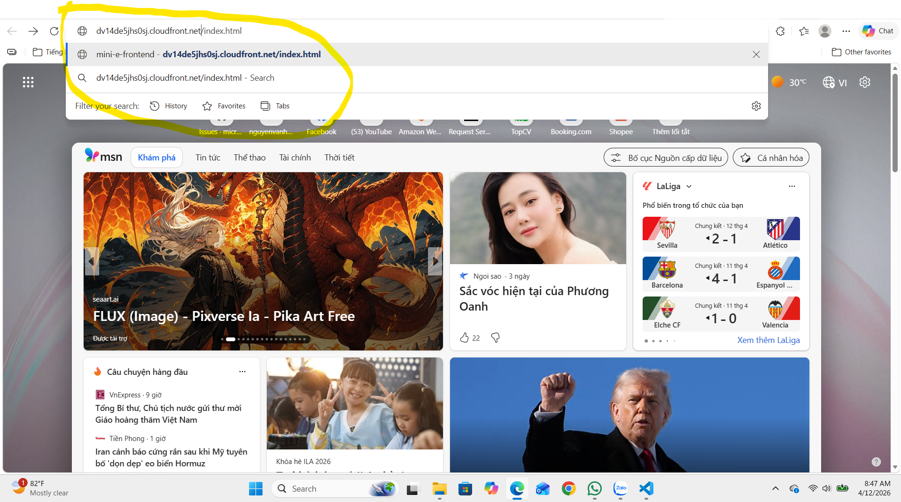
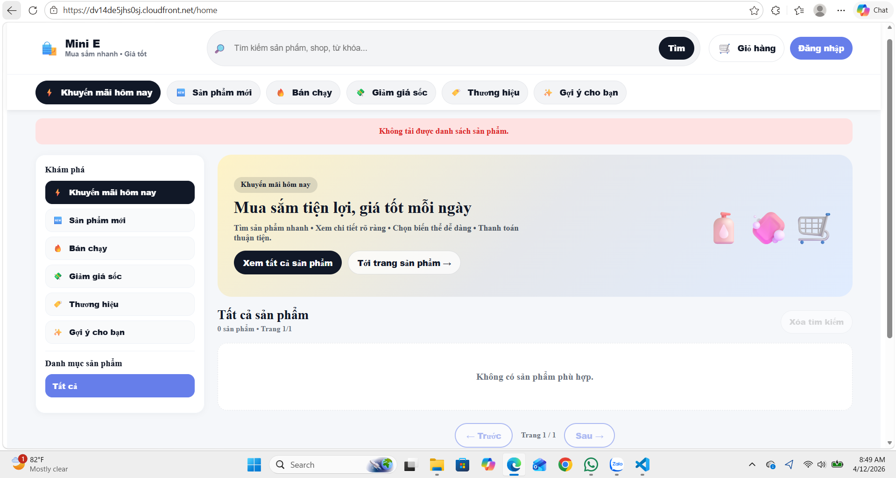

Introduction to Amazon CloudFront
1. Tải toàn bộ nội dung trong folder dist lên S3

b1: Vào S3 Bucket của bạn nhấn Upload.

Kéo và thả toàn bộ các file bên trong folder dist (thường bao gồm index.html, các file .js, .css, và folder assets) vào trình duyệt.

Lưu ý: Đảm bảo file index.html nằm ở ngay thư mục gốc của S3 bucket (không nên để nằm trong một folder con bên trong bucket).

2. Cấu hình "Default Root Object" cho CloudFront
Đây là bước cực kỳ quan trọng. Khi người dùng truy cập vào tên miền CloudFront (ví dụ: d123.cloudfront.net), CloudFront cần biết phải mở file nào đầu tiên (thường là index.html).

Vào dịch vụ CloudFront, chọn Distribution bạn đã tạo.

Chọn tab Settings và nhấn Edit.

Tìm mục Default root object.
Gõ vào: index.html.

Cuộn xuống dưới và nhấn Save changes.

sẽ k save changes được do k có quyền =3

3. Cấu hình Error Pages 
Lấy Domain Name: Trong bảng điều khiển CloudFront, hãy copy cái Distribution domain name (có dạng xxxx.cloudfront.net).

Mở tab mới trên trình duyệt: Dán Domain Name đó vào.

Thêm tên file: Gõ thêm /index.html vào cuối đường dẫn.
Ví dụ: https://d3rt5example.cloudfront.net/index.html

Kiểm tra: Nếu trang web của bạn hiện lên, chúc mừng bạn đã thành công "vượt rào" bài lab này!
HTTP Response Code: Chọn 200: OK.
 

Lưu ý nội dung được sửa deploy FE không hoàn toàn có trong lab