Task 1: Khởi chạy thực thể EC2 (Launch Instance)
Trong bước này, sẽ tạo một máy chủ web có tính năng bảo vệ chống xóa nhầm.

Vào dịch vụ EC2: Tìm kiếm EC2 trên thanh tìm kiếm của AWS Console.

Nhấn Launch instance:

Name: Nhập Web Server.

AMI: Chọn Amazon Linux 2023 AMI.

Instance type: Chọn t3.micro (2 vCPU, 1 GiB RAM).

Key pair: Chọn Proceed without a key pair (vì bài lab này không yêu cầu đăng nhập trực tiếp vào server).

Cấu hình mạng (Network settings): Nhấn Edit.

VPC: Chọn cái có tên Lab VPC.

Subnet: Chọn Public Subnet 1.

Firewall (Security Groups): Chọn Select existing security group và chọn cái có tên Web Server security group.
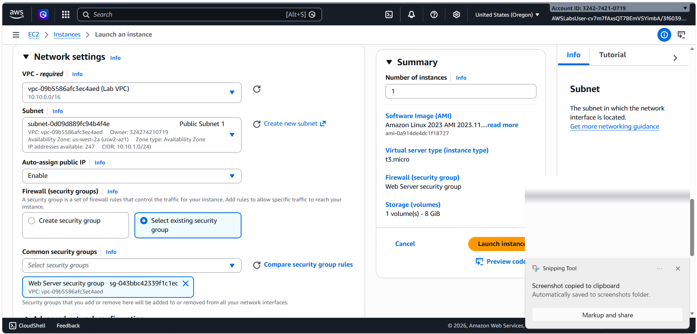 

Cấu hình nâng cao (Advanced details):

Tìm mục Termination protection: Chọn Enable (Bật bảo vệ chống xóa).
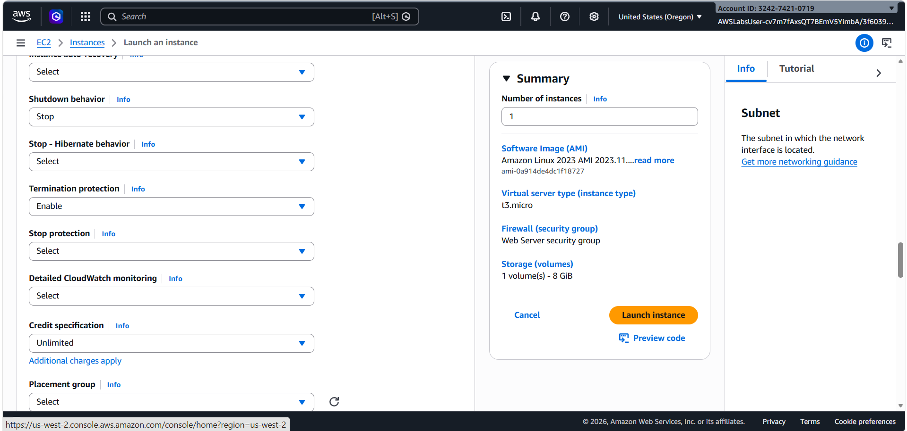 

Cuộn xuống cuối cùng tại mục User data, dán đoạn mã sau vào:
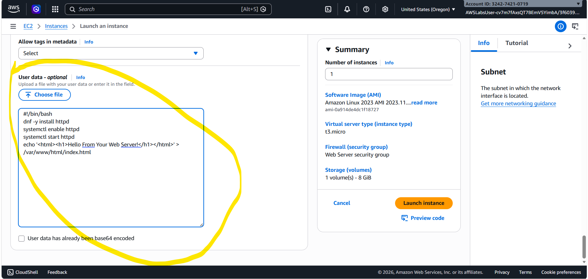 

Bash
#!/bin/bash
dnf -y install httpd
systemctl enable httpd
systemctl start httpd
echo '<html><h1>Hello From Your Web Server!</h1></html>' > /var/www/html/index.html
Hoàn tất: Nhấn Launch instance. Đợi trạng thái (Status check) chuyển sang 2/2 checks passed.
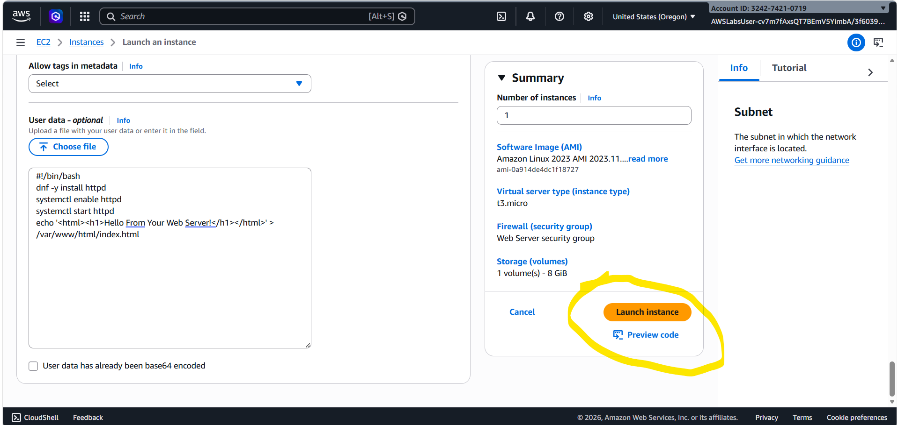

Task 2: Giám sát thực thể (Monitor Your Instance)
Kiểm tra xem server đang hoạt động như thế nào.

Status and alarms: Xem các bài kiểm tra phần cứng và phần mềm của AWS.
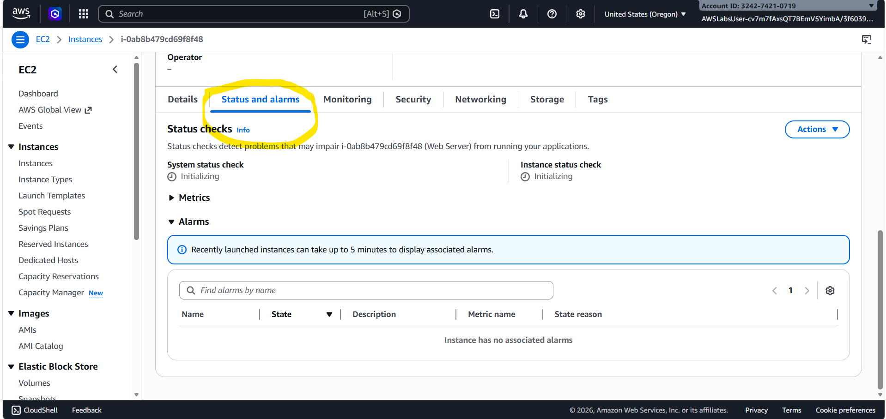

Monitoring tab: Xem biểu đồ CloudWatch (CPU, lưu lượng mạng...).
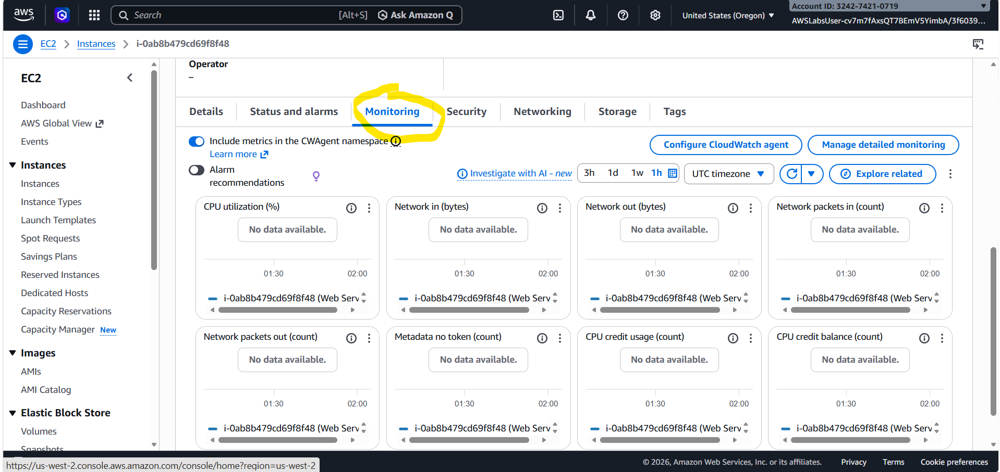

Get system log: Vào Actions > Monitor and troubleshoot > Get system log để xem quá trình cài đặt Apache có thành công không.
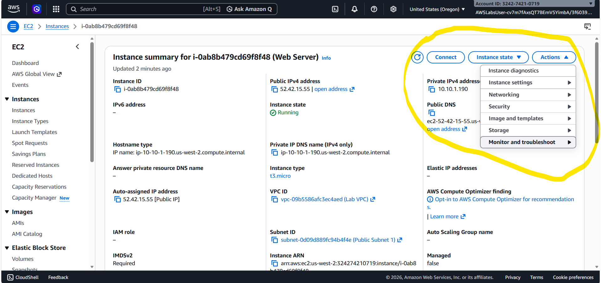

Instance screenshot: Vào Actions > Monitor and troubleshoot > Get instance screenshot để xem "màn hình" hiện tại của server (như đang nhìn vào màn hình máy tính thật).
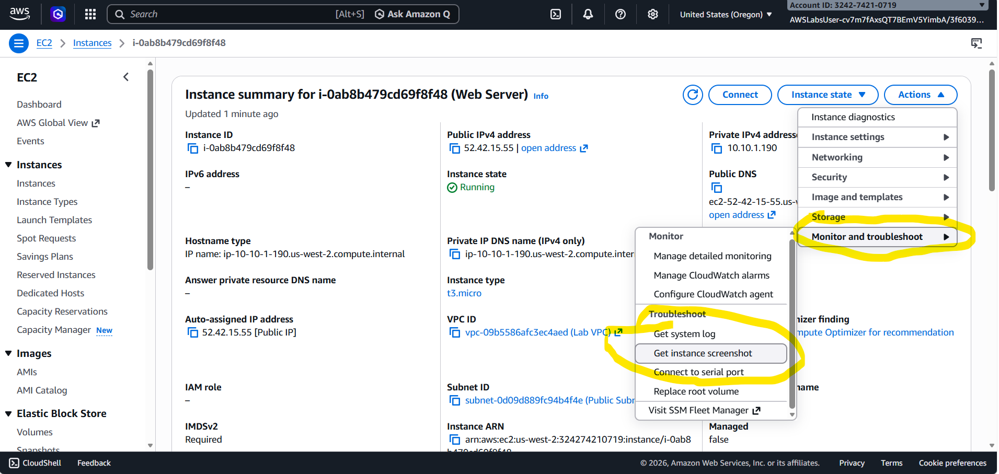

Task 3: Cấu hình Security Group và Truy cập Web
Mặc định, server sẽ chặn mọi truy cập từ bên ngoài. Bạn cần mở cổng HTTP.

Thử truy cập: Copy Public IPv4 address của server, dán vào trình duyệt. (Kết quả: Xoay vòng/Thất bại vì chưa mở cổng).
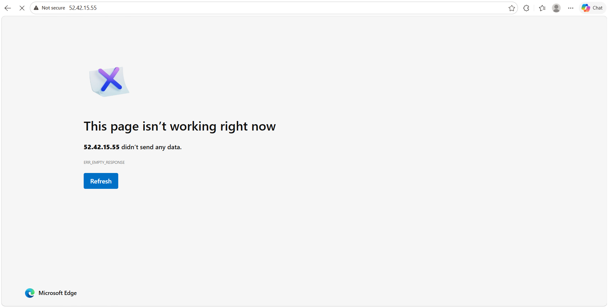

Mở cổng 80 (HTTP):

Vào menu Security Groups bên trái.

Chọn Web Server security group.

Chọn tab Inbound rules > Edit inbound rules.

Nhấn Add rule: Chọn Type là HTTP, Source là Anywhere-IPv4 (0.0.0.0/0).

Nhấn Save rules.
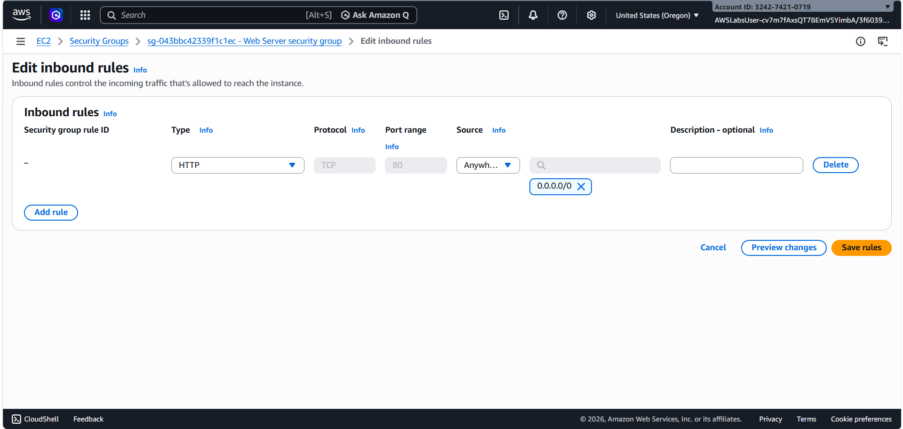

Kiểm tra lại: Quay lại tab trình duyệt lúc nãy và Refresh. Bạn sẽ thấy dòng chữ: "Hello From Your Web Server!".
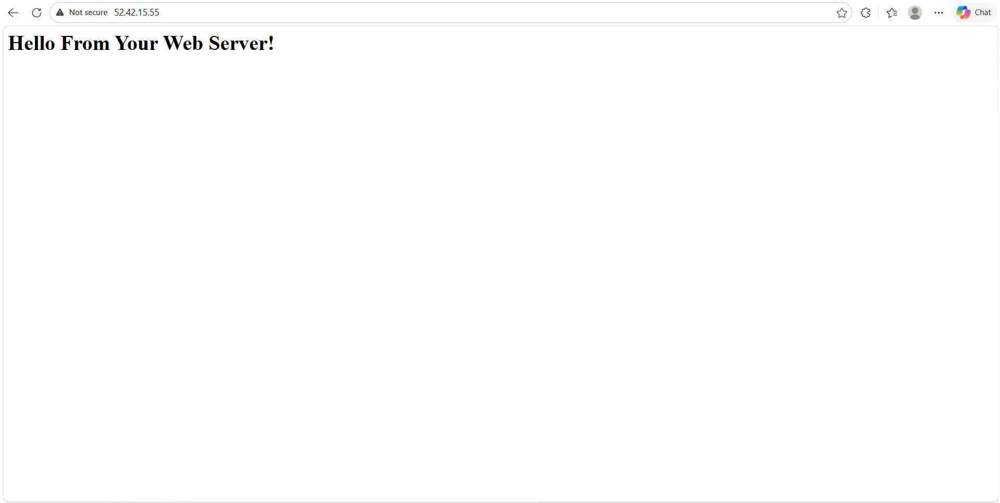 

Task 4: Thay đổi kích thước (Resize Instance)
Khi server quá yếu, bạn có thể nâng cấp nó lên.

Dừng Server: Chọn Web Server > Instance state > Stop instance. (Bắt buộc phải dừng mới sửa được phần cứng). Đợi trạng thái chuyển sang Stopped.
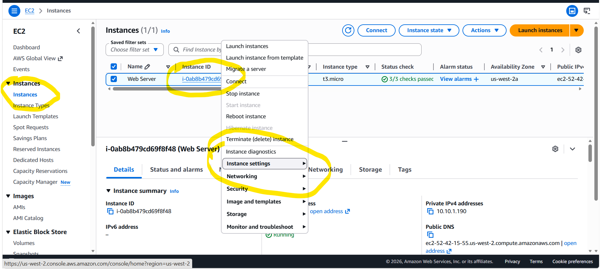 

Đổi cấu hình: Chọn Actions > Instance settings > Change instance type.
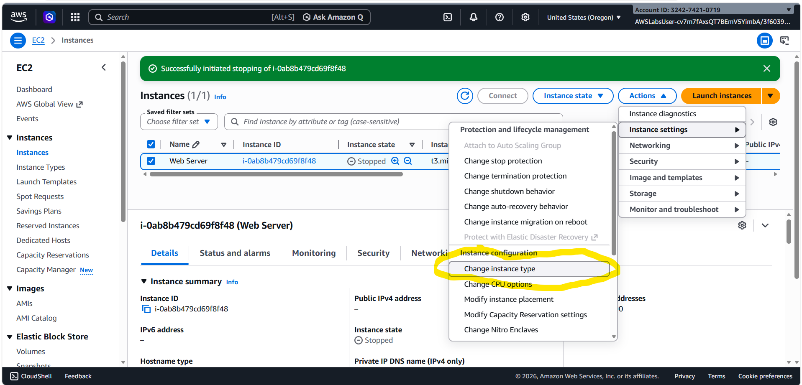 

Chọn t3.small. Nhấn Change.

Tăng dung lượng ổ đĩa (EBS):
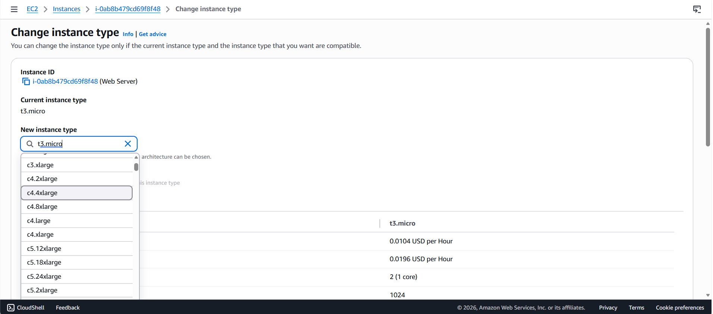 

Vào menu Volumes (dưới mục Elastic Block Store).

Chọn ổ đĩa hiện tại > Actions > Modify volume.

Đổi từ 8 GiB thành 10 GiB. Nhấn Modify.

Khởi động lại: Quay lại mục Instances, chọn server và nhấn Start instance.

Task 5: Kiểm tra tính năng Bảo vệ chống xóa
Bạn sẽ thử xóa server để xem lớp bảo vệ hoạt động ra sao.

Thử xóa: Chọn Web Server > Instance state > Terminate instance.
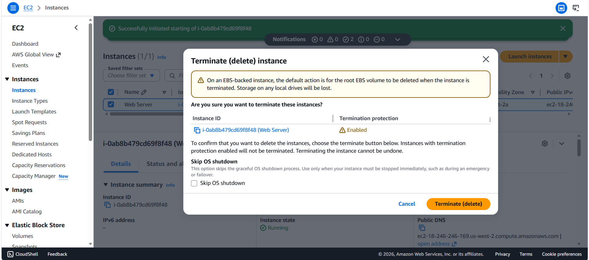 

Kết quả: Sẽ có lỗi hiện lên báo bạn không thể xóa vì đang bật Termination Protection.

Tắt bảo vệ để xóa:

Chọn Actions > Instance settings > Change termination protection.
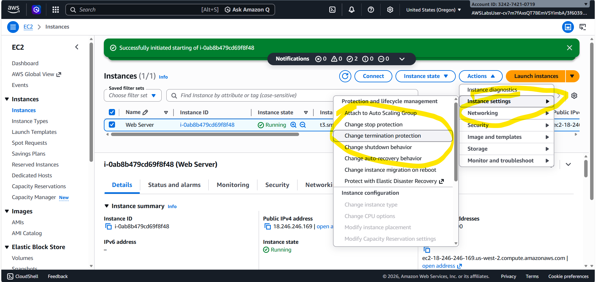 

Bỏ tích chọn Enable. Nhấn Save.

Xóa thật sự: Thực hiện lại lệnh Terminate instance. Lúc này server sẽ chuyển sang trạng thái Shutting-down rồi Terminated.
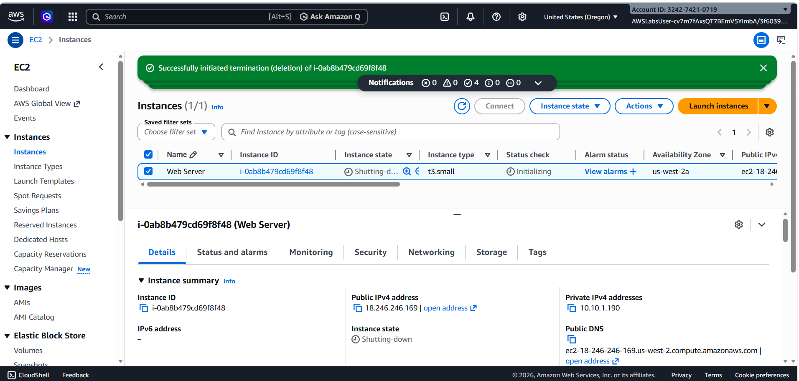 
 end lab
 