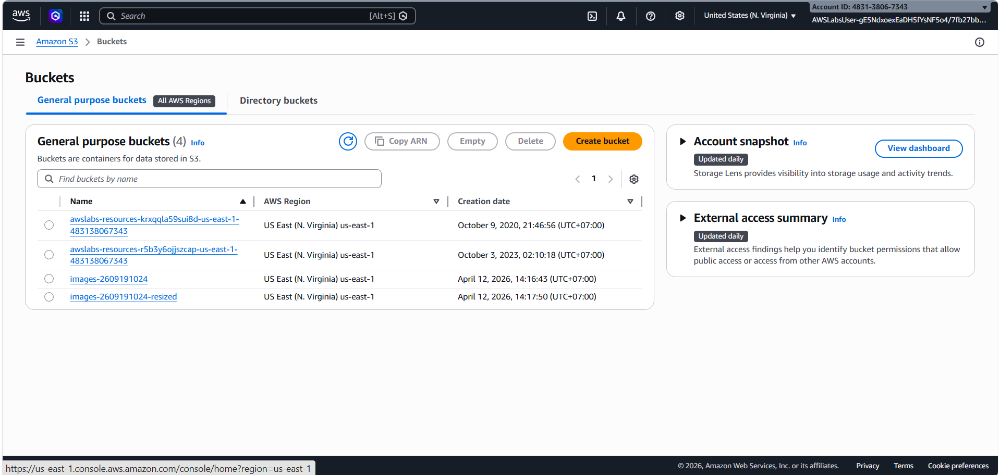
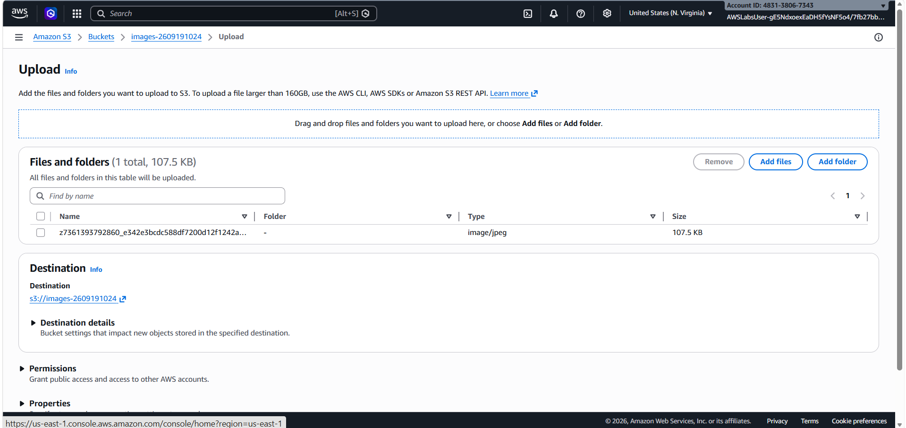
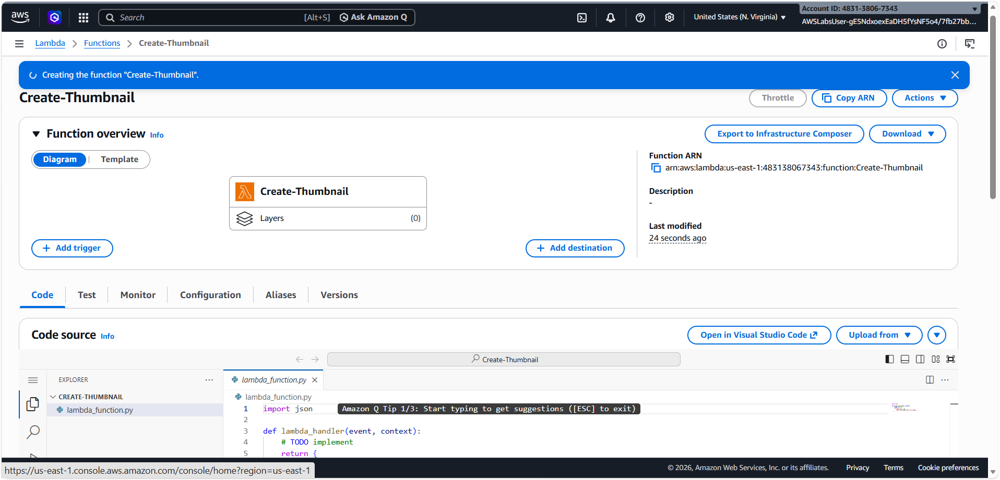
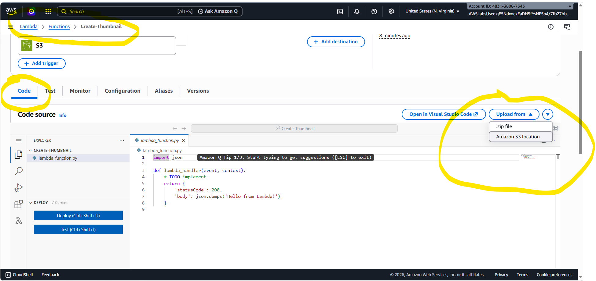
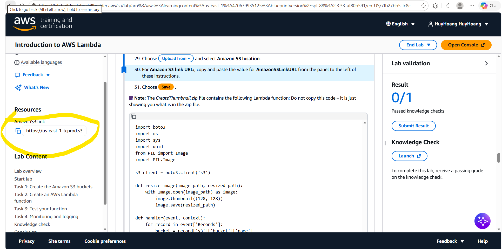
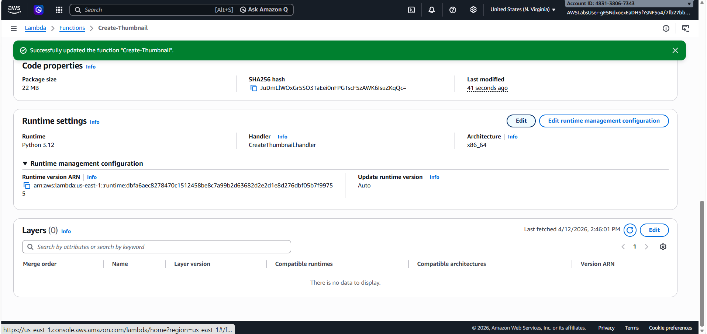
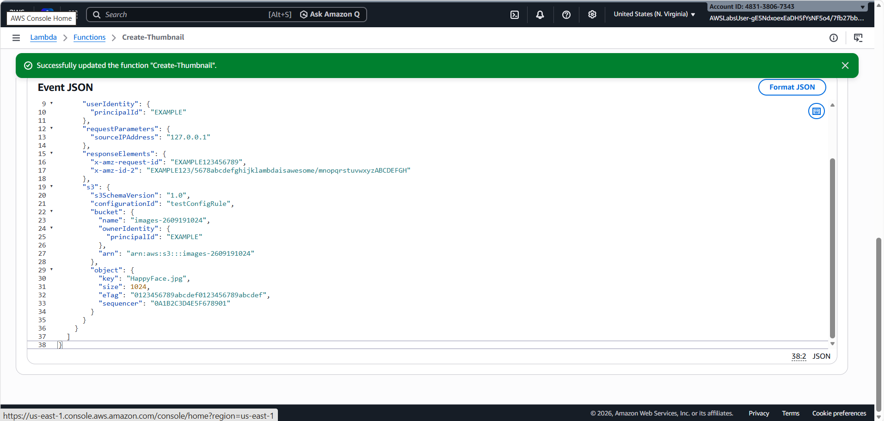
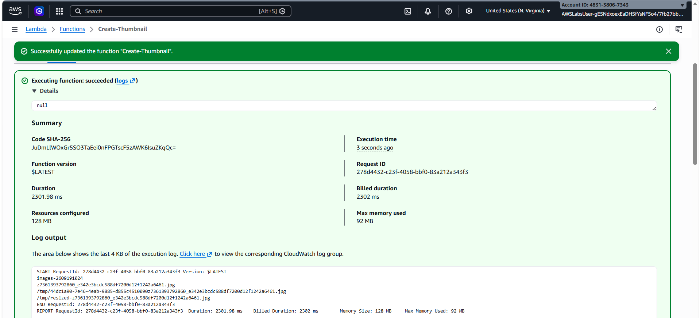
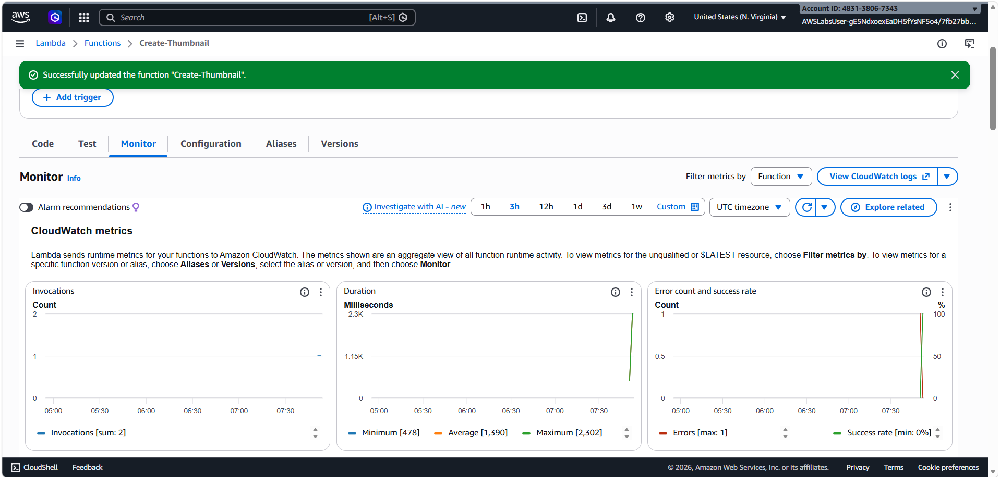

Tổng quan kiến trúc
Hệ thống hoạt động theo mô hình hướng sự kiện (Event-driven):

S3 Bucket (Input): Nơi bạn tải ảnh gốc lên.

S3 Trigger: Thông báo cho Lambda rằng "có file mới rồi!".

AWS Lambda: Chạy mã Python để xử lý ảnh.

S3 Bucket (Output): Nơi lưu trữ ảnh đã được thu nhỏ.

Task 1: Tạo các Amazon S3 Bucket
Bạn cần 2 "kho chứa" (bucket): một cái để nhận ảnh gốc, một cái để chứa ảnh đã xử lý.

Vào dịch vụ S3 > Create bucket.

Bucket 1 (Input): Đặt tên dạng images-[số-ngẫu-nhiên] (Ví dụ: images-123456). Để các cài đặt khác mặc định và nhấn Create.

Bucket 2 (Output): Tạo thêm một cái tên là images-[số-ngẫu-nhiên]-resized.
 

Tải ảnh mẫu: Tải file HappyFace.jpg về máy và upload nó vào Bucket 1.
 

Task 2: Tạo hàm AWS Lambda
Đây là "bộ não" của hệ thống.

Vào dịch vụ Lambda > Create function > Chọn Author from scratch.

Cấu hình cơ bản:

Function name: Create-Thumbnail.

Runtime: Python 3.12.

Permissions: Chọn Use an existing role và chọn lambda-execution-role.

Cấu hình mạng (VPC): Trong phần Additional configurations, chọn đúng VPC, Subnet và Security Group mà lab yêu cầu.
 

Thêm Trigger (Bộ kích hoạt):

Nhấn Add trigger > Chọn S3.

Chọn đúng Bucket 1 (bucket đầu vào).

Event type: All object create events.

Tải mã nguồn:

Tại tab Code, chọn Upload from > Amazon S3 location.
 

Dán đường dẫn S3 Link URL mà lab cung cấp vào.
 

Quan trọng: Trong phần Runtime settings, nhấn Edit và đổi Handler thành CreateThumbnail.handler.
 

Task 3: Kiểm tra hoạt động (Testing)
Bạn sẽ giả lập một sự kiện để xem Lambda có chạy đúng không.

Tại tab Test, tạo một Event mới tên là Upload.

Chọn Template là S3 Put.

Sửa mã JSON: Tìm chỗ example-bucket và đổi thành tên Bucket 1 của bạn. Tìm chỗ test%2Fkey và đổi thành HappyFace.jpg.
 

Nhấn Test. Nếu hiện chữ Succeeded là thành công!
 

Kiểm tra kết quả: Quay lại S3, mở Bucket 2 (-resized), bạn sẽ thấy file HappyFace.jpg ở đó với kích thước nhỏ hơn nhiều.

Task 4: Giám sát và Nhật ký (Monitoring & Logs)
Kiểm tra xem hệ thống vận hành ra sao "dưới nắp capo".

Tại hàm Lambda, chọn tab Monitor. Bạn sẽ thấy các biểu đồ về số lần chạy (Invocations), thời gian chạy (Duration) và lỗi (Errors).
 

Nhấn View CloudWatch logs để xem chi tiết từng dòng lệnh đã thực hiện. Đây là nơi bạn sẽ tìm lỗi nếu hàm Lambda không chạy như ý muốn.
 
