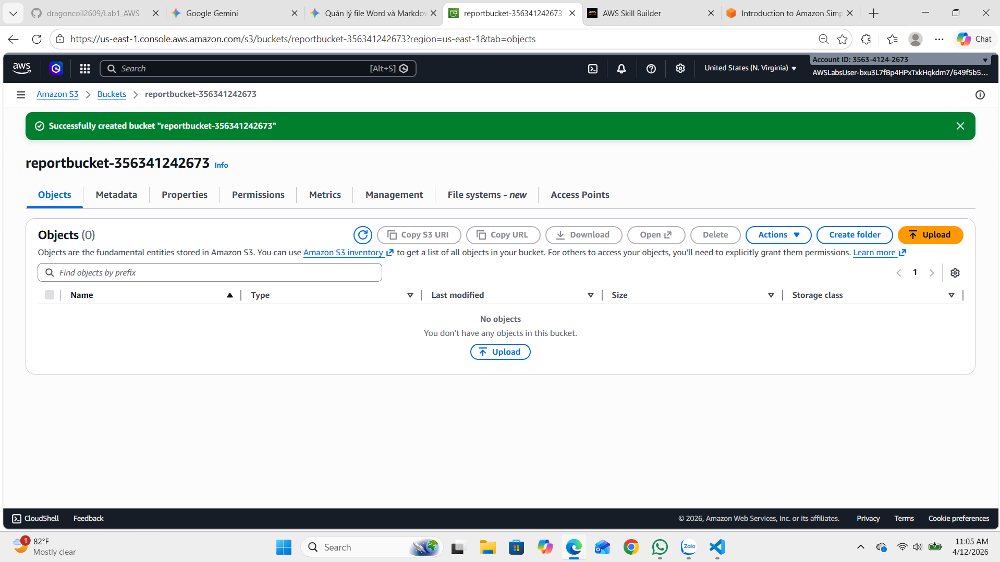
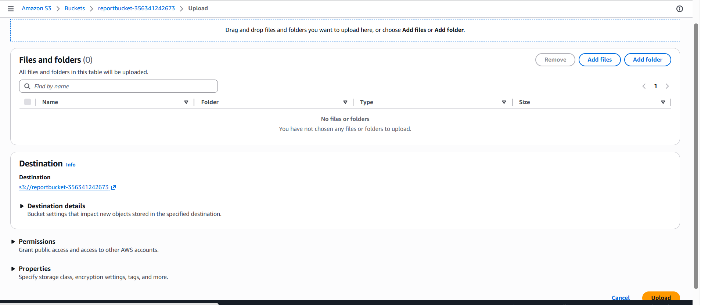
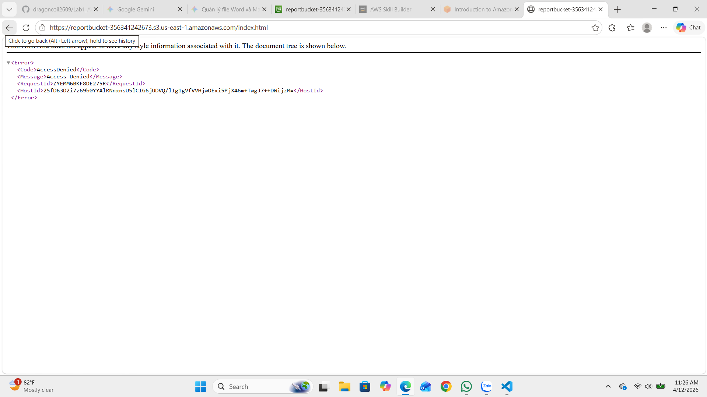
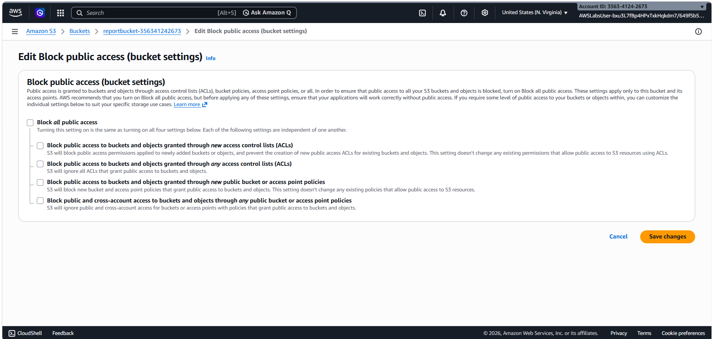
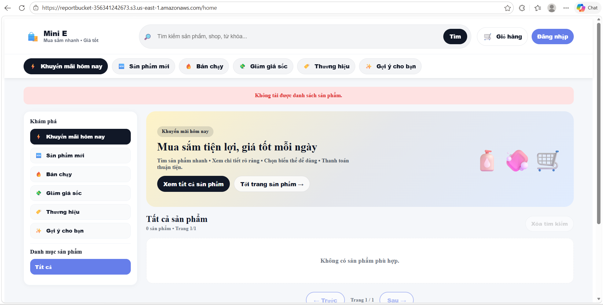
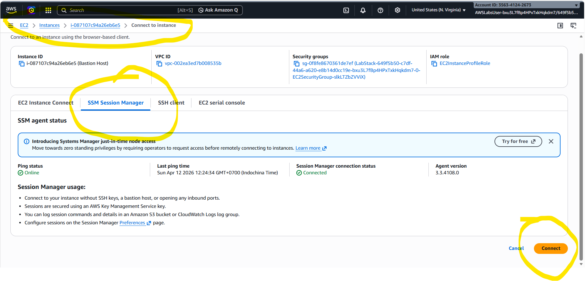
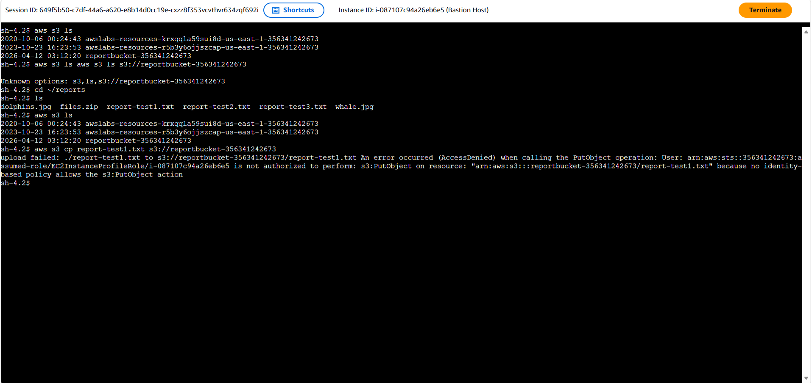
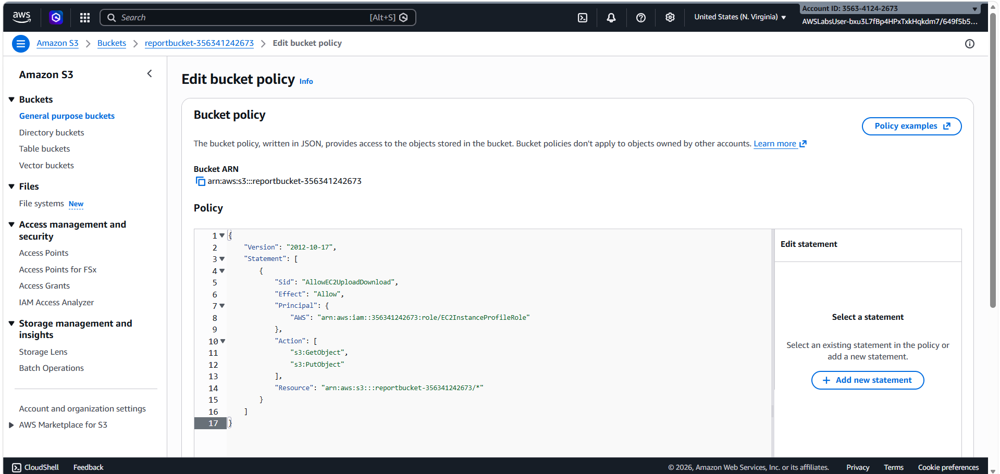
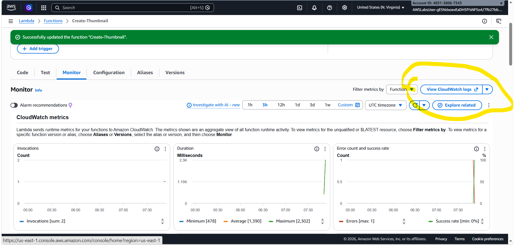

Task 1: Tạo S3 Bucket
Vào dịch vụ S3 từ Console.

Nhấn Create bucket.

Tên Bucket: Phải duy nhất trên toàn cầu. Đặt tên theo mẫu: reportbucket-<Account-ID-của-bạn>.

Mẹo: Copy Account ID ở menu AWSLabsUser góc trên bên phải.

Object Ownership: Chọn ACLs enabled và Object writer.

Giữ các thông số khác mặc định và nhấn Create bucket.
 

Task 2: Tải đối tượng lên Bucket
Tải file ảnh new-report.png về máy tính cá nhân.

Chọn bucket bạn vừa tạo > Nhấn Upload > Add files.
v 

Chọn file ảnh và nhấn Upload. Khi hiện thanh màu xanh là thành công.
 
Task 3: Thử nghiệm quyền truy cập công khai (Public Access)
Mặc định, mọi thứ trên S3 là Private (Riêng tư).

Thử copy Object URL của file ảnh dán vào trình duyệt -> Bạn sẽ nhận lỗi Access Denied.
 

Mở khóa:

Vào tab Permissions của Bucket.

Tại mục Block public access, nhấn Edit và bỏ chọn Block all public access -> Nhấn Save (gõ confirm để xác nhận).
 

Cấp quyền cho ảnh: Quay lại file ảnh > Object actions > Make public using ACL.

F5 lại trình duyệt cũ, ảnh sẽ hiện ra.
 

Task 4: Kiểm tra kết nối từ EC2
Bây giờ chúng ta sẽ đứng từ server EC2 để "nói chuyện" với S3.

Vào dịch vụ EC2 > Instances (running).

Chọn Bastion Host > Nhấn Connect > Chọn Session Manager > Connect.
 

Gõ các lệnh sau trong cửa sổ terminal:

aws s3 ls: Liệt kê các bucket.

aws s3 ls s3://<tên-bucket-của-bạn>: Xem file trong bucket.

cd reports và ls: Xem các file báo cáo mẫu trên server.

aws s3 cp report-test1.txt s3://<tên-bucket-của-bạn>: Thử copy file lên S3.

Kết quả: Sẽ báo lỗi Upload failed vì EC2 chưa có quyền ghi (PutObject).
 

Task 5: Tạo Bucket Policy (Cấp quyền ghi cho EC2)
Đây là bước quan trọng nhất để ứng dụng của bạn hoạt động.

Tìm ARN của EC2 Role: Vào IAM > Roles > Tìm EC2InstanceProfileRole > Copy đoạn Role ARN.

Quay lại S3 Bucket > Tab Permissions > Bucket Policy > Edit.
 

Sử dụng AWS Policy Generator để tạo mã JSON với các thông số:

Effect: Allow.

Principal: Dán Role ARN vừa copy.

Actions: Chọn GetObject và PutObject.

ARN: Dán ARN của Bucket và thêm /* ở cuối (Ví dụ: arn:aws:s3:::mybucket/*).

Nhấn Generate Policy, copy đoạn mã JSON dán vào trình duyệt S3 và Save changes.

Kiểm tra lại: Quay lại cửa sổ EC2 terminal và chạy lại lệnh aws s3 cp. Lúc này lệnh sẽ thành công!

Sau khi nhấn Save changes ở bước trên, bạn quay lại Terminal và chạy lệnh này để hưởng thành quả:

Upload lại file (Lần này sẽ thành công):

Bash
aws s3 cp report-test1.txt s3://reportbucket-356341242673
Kiểm tra file đã lên S3 chưa:

Bash
aws s3 ls s3://reportbucket-356341242673
Thử tải file từ S3 về lại server (GetObject):

Bash
aws s3 cp s3://reportbucket-356341242673/index.html ./index_from_s3.html

Task 6: Khám phá tính năng Versioning (Quản lý phiên bản)
1. Cách bật
Vào Tab Properties > Bucket Versioning > Enable.

2. Cách hoạt động (Thực hành)
Ghi đè: Tải lên file trùng tên → Gạt nút Show versions sẽ thấy cả bản cũ và mới (khác Version ID).

Xóa nhầm: Nhấn Delete → File biến mất (nhưng thực chất S3 chỉ đè lên một cái nhãn Delete marker).

3. Cách khôi phục
Gạt nút Show versions sang phải.

Tìm dòng có Type là Delete marker.

Xóa cái Delete marker đó đi.

Kết quả: File gốc sẽ tự động hiện ra trở lại.